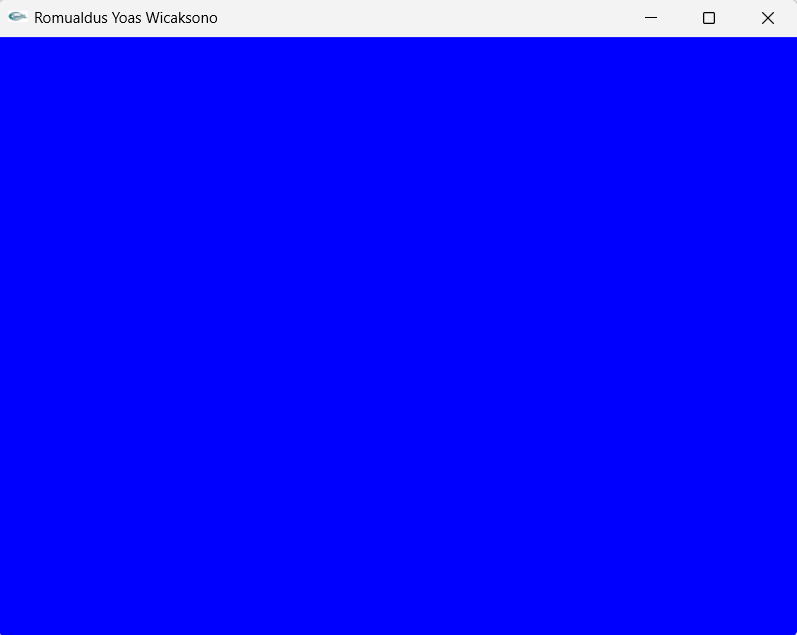
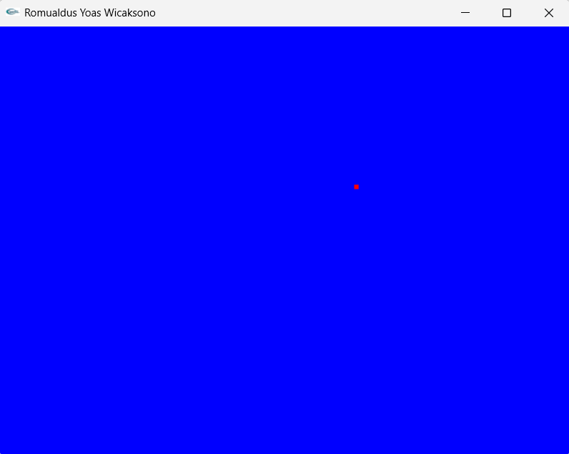
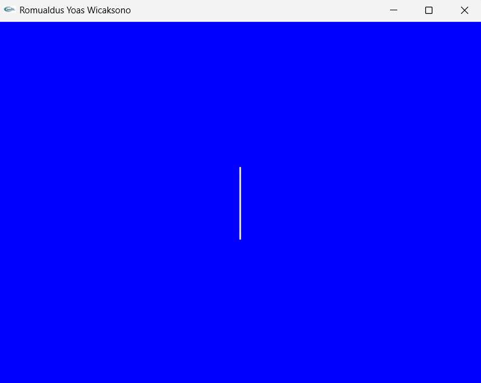
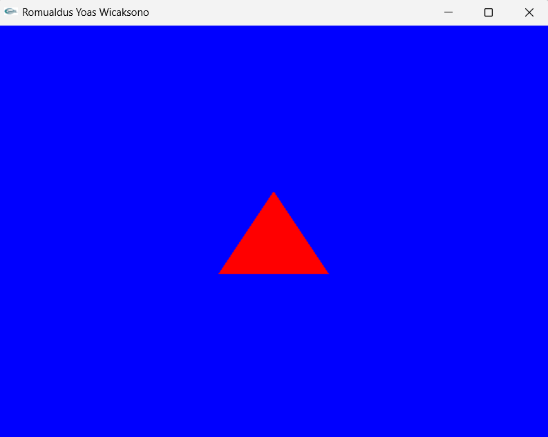
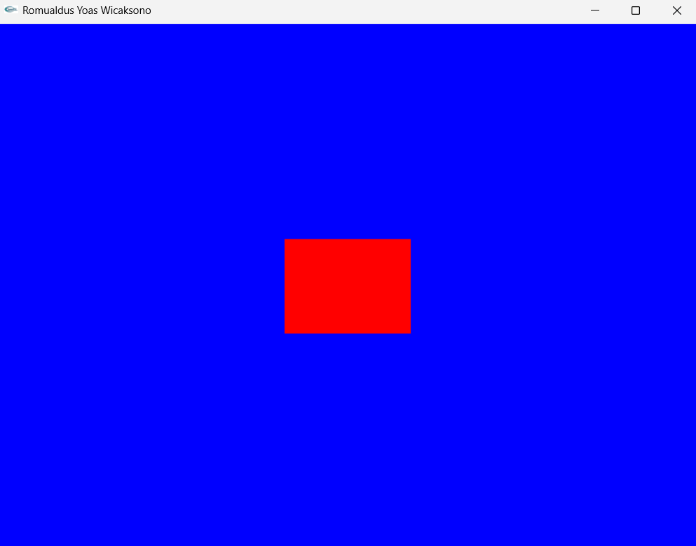
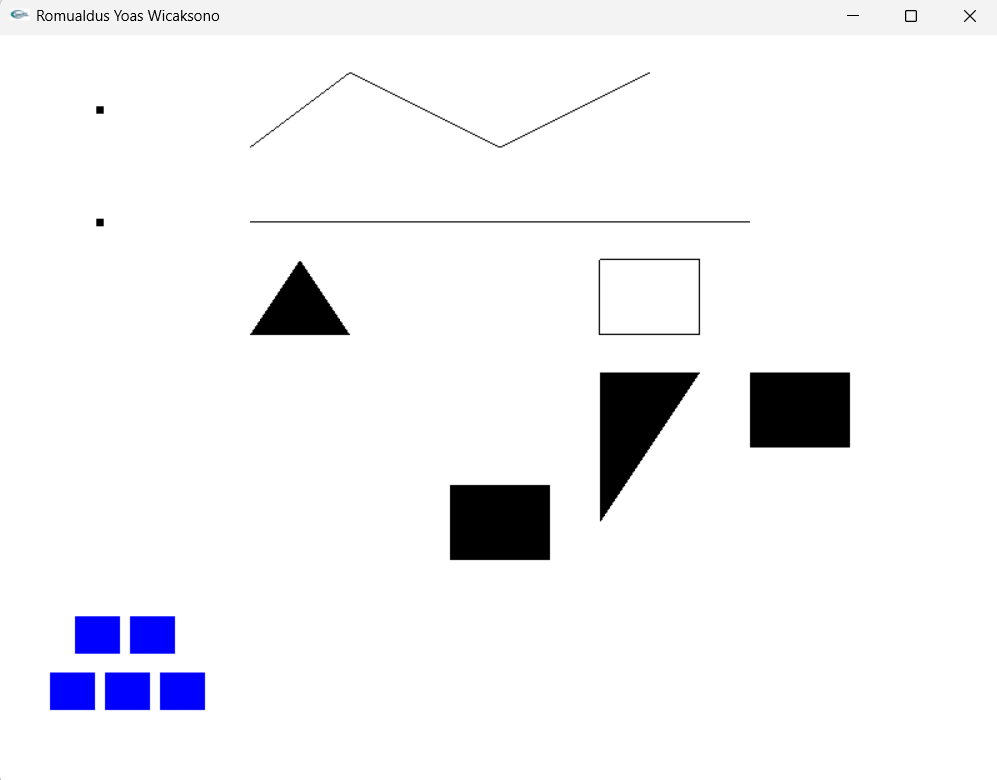

# PENUGASAN PRAKTIKUM GTI PERTEMUAN1

# NAMA: Romualdus Yoas Wicaksono
# NIM: 24060124120046
# LAB: A2

Proyek ini dibuat untuk tujuan memenuhi penugasan praktikum GTI pada pertemuan 1, program ini menampilkan bentuk dasar di OpenGL menggunakan GLUT, di antaranya yaitu:
- Primitve Drawing
- Titik
- Garis
- Segitiga
- PERSEGI

- Titik (GL_POINTS)
- Garis (GL_LINES, GL_LINE_STRIP, GL_LINE_LOOP)
- Segitiga (GL_TRIANGLE_FAN, GL_TRIANGLE_STRIP)
- Persegi (GL_QUADS, GL_QUAD_STRIP)

## SCREENSHOT PRAKTIKUM
1. 
2. 
3. 
4. 
5. 

## SREENSHOT PENUGASAN PRAKTIKUM

## RINGKASAN PENGERTIAN DAN BEDA KEGUNAAN TIAP MODE PADA OPENGL
- **GL_LINES** = Membentuk garis-garis terpisah, di mana setiap dua vertex membentuk satu garis. Digunakan untuk menggambar garis terpisah, cocok jika ingin menampilkan garis-garis individu.

- **GL_LINE_STRIP** = Membentuk garis kontinu yang menghubungkan semua vertex secara berurutan, tidak menutup loop. Digunakan untuk menggambar garis menyambung antar titik, cocok untuk membuat poligon terbuka atau jalur kontinu.

- **GL_LINE_LOOP** = Membentuk garis kontinu yang menghubungkan semua vertex secara berurutan, dengan vertex terakhir otomatis tersambung ke vertex pertama sehingga membentuk loop tertutup. Sama seperti LINE_STRIP, tapi vertex terakhir otomatis tersambung ke vertex pertama, cocok untuk membuat bentuk poligon tertutup.

- **GL_TRIANGLE_FAN** = Membentuk serangkaian segitiga yang berbagi satu titik pusat, dengan setiap segitiga menghubungkan titik pusat ke dua vertex berurutan di tepi. Digunakan untuk menggambar segitiga yang berpusat pada satu titik, ideal untuk membuat bentuk seperti lingkaran, atau area yang memancar dari satu titik.

- **GL_TRIANGLE_STRIP** = Membentuk segitiga beruntun di mana setiap tiga vertex berturut-turut membentuk satu segitiga baru, berbagi sisi dengan segitiga sebelumnya. Digunakan untuk menggambar segitiga beruntun yang saling berbagi sisi, efisien untuk membuat permukaan memanjang atau mesh sederhana.

- **GL_QUADS** = Membentuk persegi yang di mana setiap empat vertex membentuk satu persegi secara terpisah. Digunakan untuk menggambar persegi, setiap 4 vertex = satu persegi. Cocok untuk objek sederhana yang berbentuk kotak.

- **GL_QUAD_STRIP** = Membentuk strip persegi berderet, di mana setiap quad baru berbagi dua vertex dengan quad sebelumnya untuk efisiensi. Digunakan untuk menggambar strip persegi berderet yang saling berbagi sisi, lebih efisien daripada QUADS jika ingin membuat permukaan panjang dari beberapa persegi.

