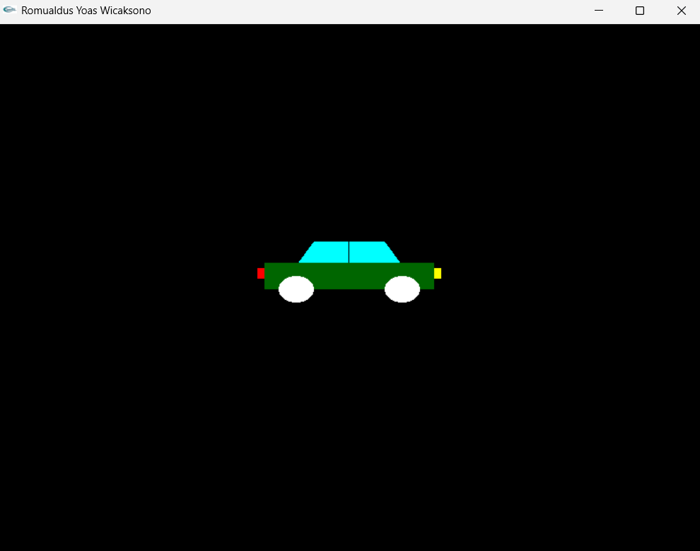

# PENUGASAN PRAKTIKUM GTI PERTEMUAN2
# NAMA: Romualdus Yoas Wicaksono
# NIM: 24060124120046
# LAB: A2

Proyek ini dibuat untuk tujuan memenuhi penugasan praktikum GTI pada pertemuan 2, program ini menampilkan bentuk sederhana dari mobil dengan detail kecil seperti kaca, strip kaca, lampu depan, dan lampu belakang di OpenGL menggunakan GLUT:

## SCREENSHOT PRAKTIKUM
**1. Screenshot Bentuk Mobil Sederhana**
