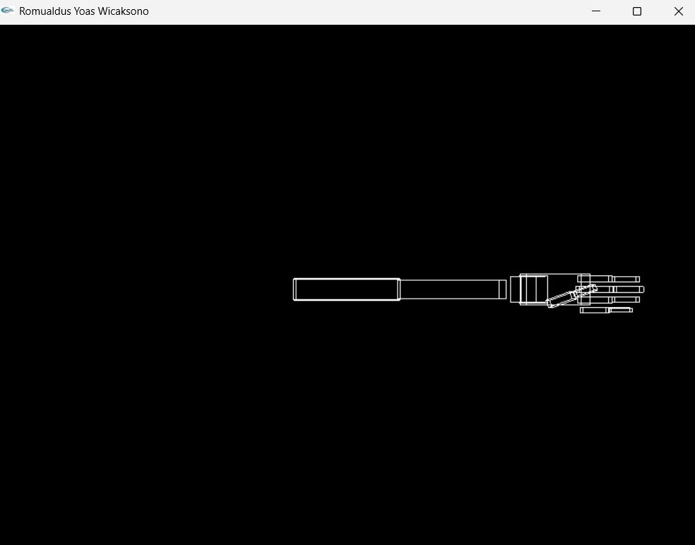
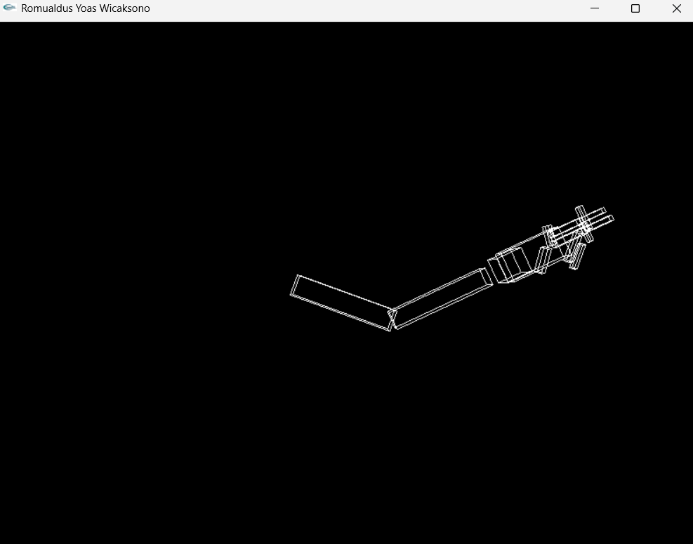
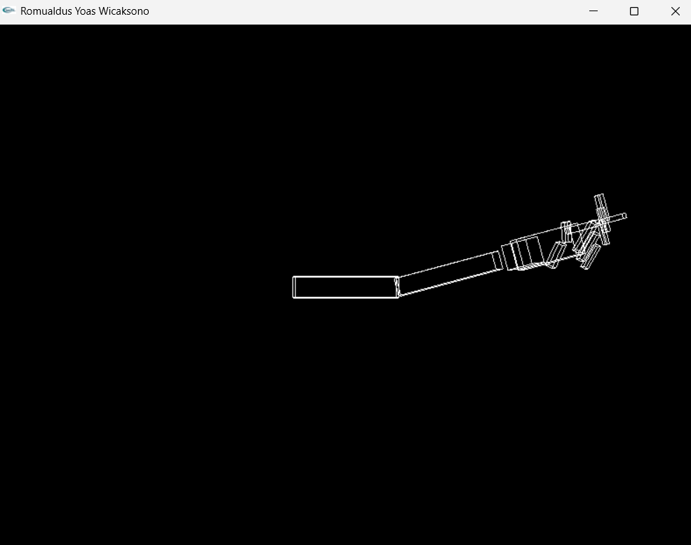
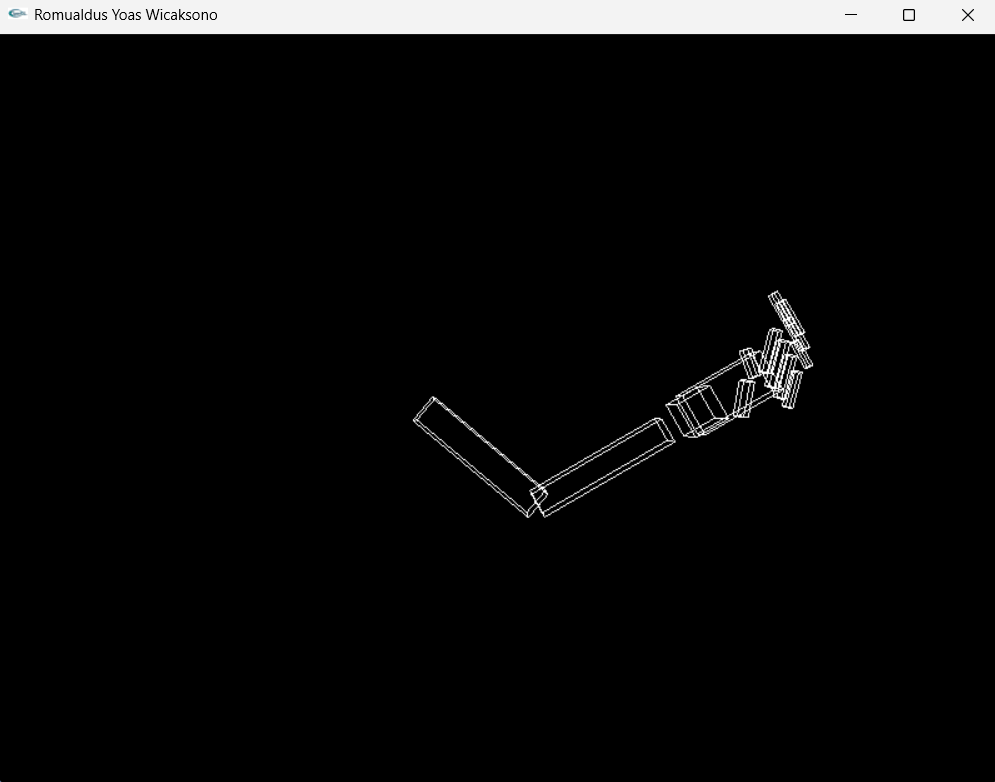

# PENUGASAN PRAKTIKUM GTI PERTEMUAN3
# NAMA: Romualdus Yoas Wicaksono
# NIM: 24060124120046
# LAB: A2

Proyek ini dibuat untuk tujuan memenuhi penugasan praktikum GTI pada Pertemuan 3, program ini menampilkan bentuk proyeksi sederhana dari cara kerja tangan robot, diantaranya bisa menggerakkan lengan, bahu, telapak tangan dan juga jari pada OpenGL dengan menggunakan GLUT:

Pada program ini saya menerapkan 2 cara menggerakkan tangan, bisa manual dengan memilih bagian mana yang digerakkan atau dengan menggunakkan preset pose yang sudah disediakan. Untuk cara manual sendiri, berikut merupakan beberapa keypad yang digunakan:

**PRESET POSE TANGAN**
- 0 = IDLE
- p/P = FINGER POINTING
- g/G = GENGGAM
- k/K = PEACE

**PROYEKSI MANUAL**

**1. Seleksi Jari**
- 1 = ibu jari
- 2 = jari telunjuk
- 3 = jari tengah
- 4 = jari manis
- 5 = jari kelingking

**2. Seleksi Ujung atau Pangkal jari**
- v/V = ujung jari
- f/F = pangkal

**3. Gerakkan menekuk atau Meluruskan Jari**
- e/E = meluruskan atau menggerakkan ke kanan
- q/Q = membengkokkan atau digerakkan ke kiri

**4. Kontrol Tangan**
- w/W = menggerakkan bahu ke kiri
- s/S = menggerakkan bahu ke kanan
- a/A = menggerakkan lengan ke kiri
- d/D = menggerakkan lengan ke kanan
- z/Z = menggerakkan telapak tangan ke kiri
- x/X = menggerakkan telapak tangan ke kanan

## SCREENSHOT PROYEKSI TANGAN
**1. Posisi Idle**

**2. Pose Peace**

**3. Pose Finger Pointing**

**4. Pose Genggam**
