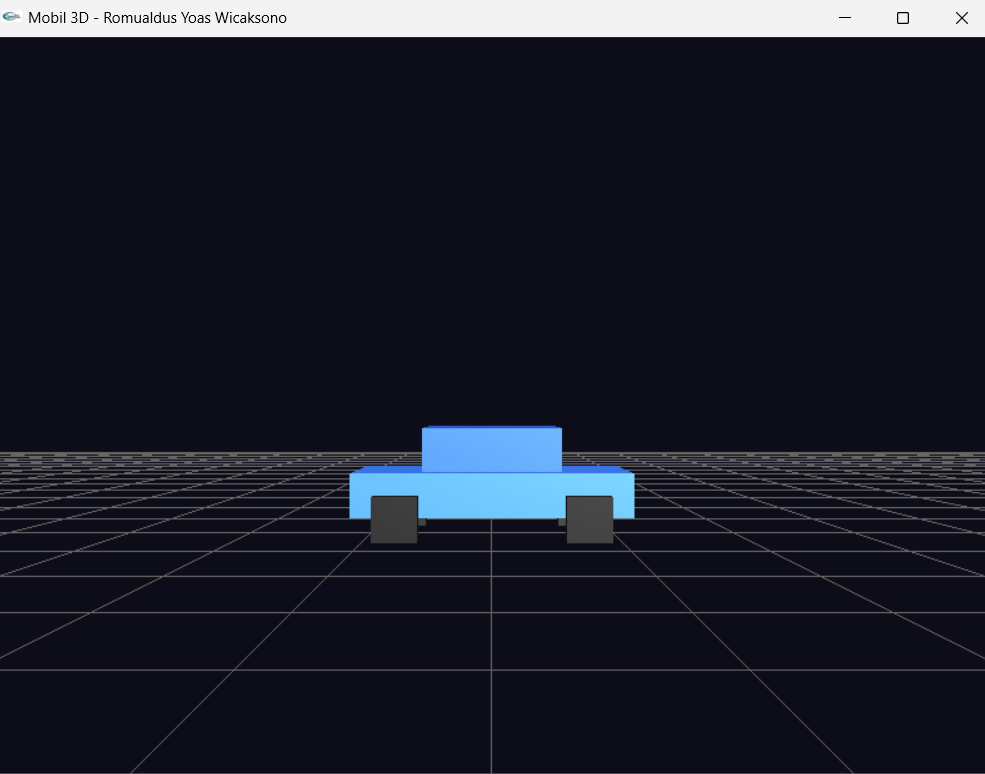
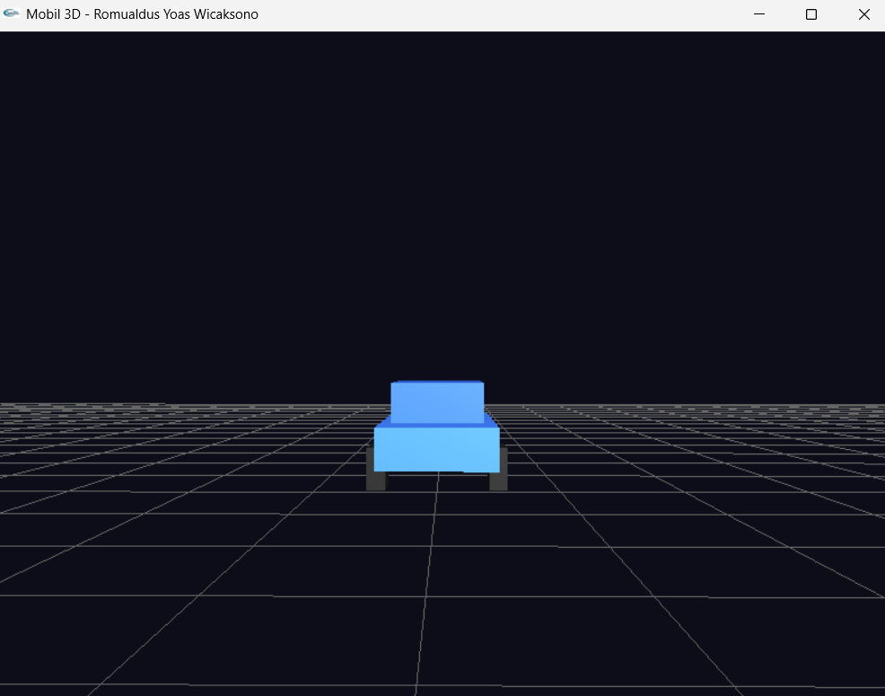
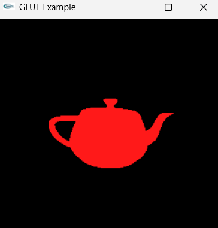
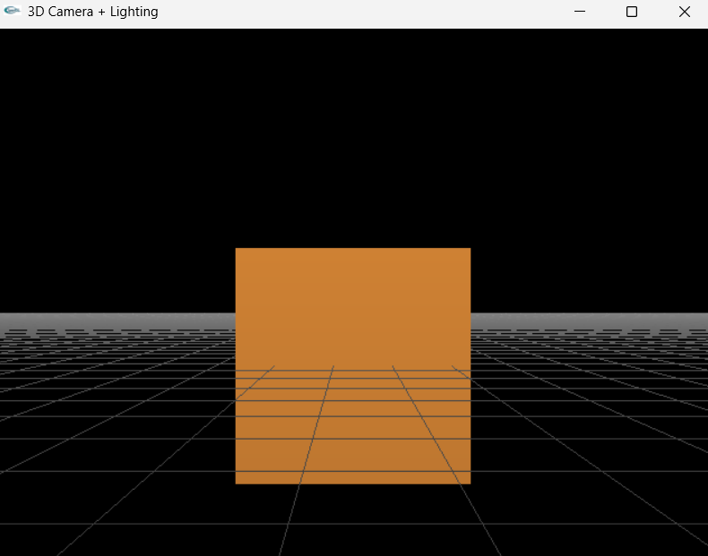

# PENUGASAN PRAKTIKUM GTI PERTEMUAN 4
# NAMA: Romualdus Yoas Wicaksono
# NIM: 24060124120046
# LAB: A2

Proyek ini dibuat untuk tujuan memenuhi penugasan praktikum GTI pada Pertemuan 4. Program ini menampilkan bentuk proyeksi Mobil 3D sederhana, di mana menerapkan *Depth Testing* (Z-Buffer) agar tumpukan objek merender dengan benar sesuai jarak, serta sistem pencahayaan (*Lighting* dan *Material*) agar permukaan mobil bereaksi terhadap cahaya dan memiliki dimensi visual yang realistis.

Pada program ini, Pengguna dapat menavigasi ruang 3D secara manual untuk melihat mobil dari berbagai sudut. Berikut merupakan *keypad* yang digunakan untuk kontrol kamera:

**KONTROL KAMERA**
- Arrow Atas = Menggerakkan posisi kamera maju
- Arrow Bawah = Menggerakkan posisi kamera mundur
- Arrow Kiri = Memutar arah pandangan kamera ke kiri
- Arrow Kanan = Memutar arah pandangan kamera ke kanan
- q/Q/ESC = Keluar dari program

## SCREENSHOT PROYEKSI MOBIL 3D
**1. Tampilan Samping Mobil**

**2. Tampilan Sudut Lainnya**

Untuk praktik dari materi berupa kamera dan lightning adalah sebagai berikut:

## SCREENSHOT PROYEKSI KAMERA & LIGHTNING
**1. Tampilan Kamera**

**2. Tampilan Lightning & Depth**
